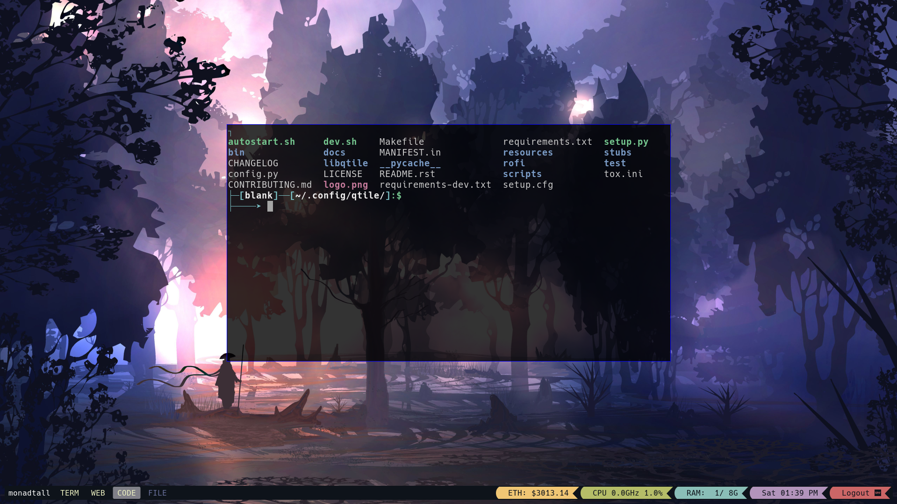
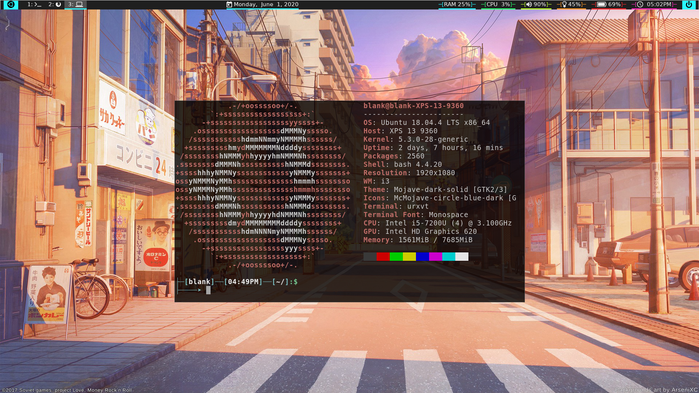

# Things To Install For Ubuntu 20.04
## QTile Screenshot


## Installing QTile
- Run qtile-install script
- Download NerdFront [here](https://www.nerdfonts.com/font-downloads).
  - Unzip the font
  - Move to `~/.local/share/fonts/`
  - Clear font cache `fc-cache -f -v`
  - Check font `fc-match "<font-name>"`
- Move config files to .config/qtile/
```
cp ~/dotfiles/.config/qtile/ ~/.config/qtile/
```

## I3 Screenshot


## Installing I3
- Run i3-install script


# TIPS and TRICKS
## Change ubuntu theme
```
/usr/share/gnome-shell/theme/ubuntu.css
```
## Install powerline ( tecmint's instructions )
```
sudo apt-get install python-pip
sudo pip install git+git://github.com/Lokaltog/powerline
wget https://github.com/powerline/powerline/raw/develop/font/10-powerline-symbols.conf
wget https://github.com/powerline/powerline/raw/develop/font/PowerlineSymbols.otf
mv PowerlineSymbols.otf /usr/share/fonts/
fc-cache -vf /usr/share/fonts/
mv 10-powerline-symbols.conf /etc/fonts/conf.d/
pip show powerline-status
```
## Change login screen background  (NOTE: Seems to break the system; Advised against trying)
```
sudo vi /usr/share/gnome-shell/theme/ubuntu.css
\#lockDialogGroup {
background: #2c001e url(file:///home/blankstr13/Pictures/background/background.jpg);
background-position: center;
background-repeat: no-repeat;
background-size: cover; }
```
## Set root password
```
sudo passwd root
```
## Control brightness for Dell XPS-13
I3 Example
```
# Change file permission to use a script to modify brightness
sudo echo chmod o+rw /sys/class/backlight/brightness >> rc.local

bindsym XF86MonBrightnessUp exec ~/Scripts/light up # increase screen brightness
bindsym XF86MonBrightnessDown exec ~/Scripts/light down # decrease screen brightness

```
## Natural scroll
```
sudo apt install xinput
- Configuration file located: /usr/share/X11/xorg.conf.d/
- Libinput approach:
    Add { Option "NaturalScrolling" "true" } to /usr/share/X11/xorg.conf.d/40-libinput.conf in the correct InputClass touchpad section
- Synaptics approach:
    Add {Option "VertScrollDelta" "-26"}, and {Option "HorizScrollDelta" "-26"} to {Identifier "touchpad catchall"}.
    - Number represent scroll speed. Lower=faster, Higher=slower.
    - Positive = Inverted Scrolling.
    - Negative = Natural Scrolling.

```

### Setting a static IP
[Guide on how to configure static IP address.](https://linuxize.com/post/how-to-configure-static-ip-address-on-ubuntu-18-04/)

