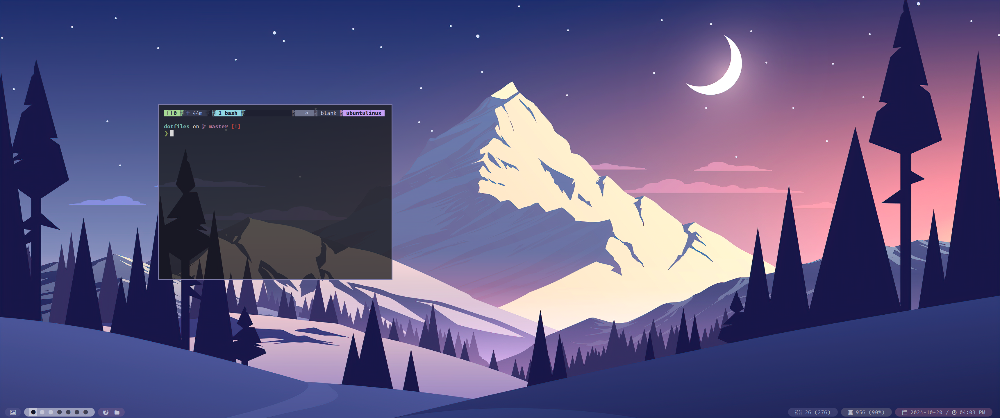

# Dotfiles for qtile on Ubuntu 24.04
My ever-growing frankenstine linux rice. I also mapped the keys to work directly with my ergo split keyboard and is meant for an ultrawide screen so these shortcuts and layout may not be optimal for everyone. The style as well as some of the script are from [Stephan Raabe's mylinuxforwork dotfiles](https://github.com/mylinuxforwork/dotfiles) though he uses Arch and I'm no where as cool nor have the time to pull that off.

## QTile Screenshot



## Installation
- Install dependencies and symlink config files.
```
./install.sh
```
- Install Qtile
```
./qtile-install.sh
```
- Install Theme
```
./qtile-install.sh
```
- Install fonts
```
./qtile-install.sh
```

# TIPS and TRICKS
## Control brightness for Dell XPS-13
Overriding file containing brightness level.
```
# Change file permission to use a script to modify brightness
sudo echo chmod o+rw /sys/class/backlight/brightness >> rc.local

# Keymap for I3wm but can easily be adapted. 'XF86MonBrightnessUp' and 'XF86MonBrightnessDown' are the buttons.
bindsym XF86MonBrightnessUp exec ~/Scripts/light up # increase screen brightness
bindsym XF86MonBrightnessDown exec ~/Scripts/light down # decrease screen brightness

```
## Natural scroll
```
sudo apt install xinput
- Configuration file located: /usr/share/X11/xorg.conf.d/
- Libinput approach:
    Add { Option "NaturalScrolling" "true" } to /usr/share/X11/xorg.conf.d/40-libinput.conf in the correct InputClass touchpad section
- Synaptics approach:
    Add {Option "VertScrollDelta" "-26"}, and {Option "HorizScrollDelta" "-26"} to {Identifier "touchpad catchall"}.
    - Number represent scroll speed. Lower=faster, Higher=slower.
    - Positive = Inverted Scrolling.
    - Negative = Natural Scrolling.

```

### Setting a static IP
[Guide on how to configure static IP address.](https://linuxize.com/post/how-to-configure-static-ip-address-on-ubuntu-18-04/)
